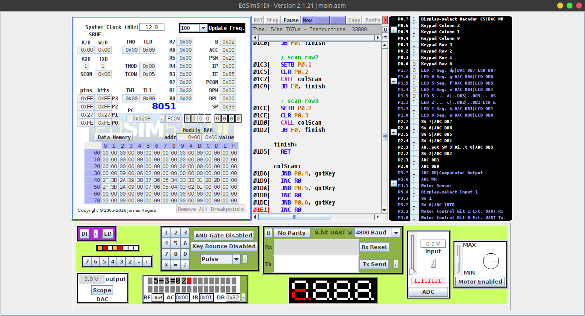
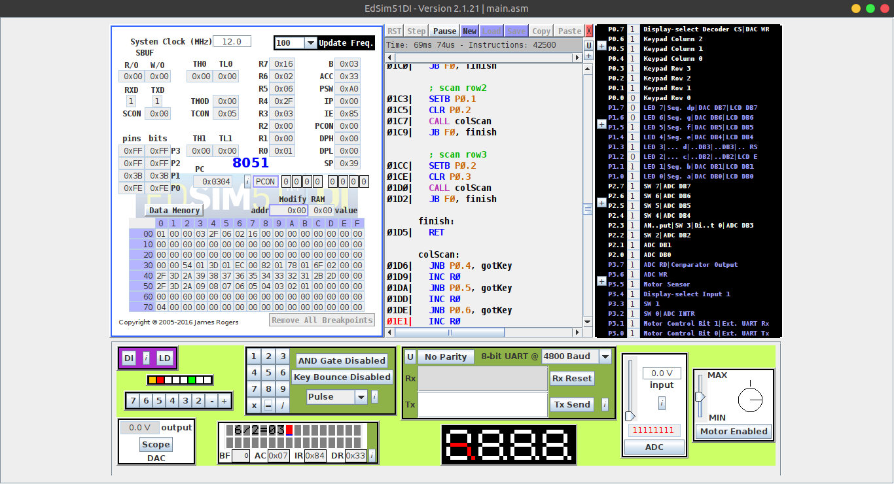

# Calculadora - Assembly 

Projeto semestral para a matéria de Arquitetura de Computadores, disciplina cursada no Centro Universitário FEI. Realização de operações matemáticas no sistema edsim51.

## Funcionalidade

O programa lê os dois números digitados pelo usuário, por meio do keypad, bem como a operação desejada (soma, subtração, divisão ou multiplicação). Exibindo os resultados no LCD.

**1 - Soma** - Exibe o resultado da soma formada pelos dois números. 

**2 - Subtração** - Exibe o resultado da subtração formada pelos dois números.

**3 - Multiplicação** - Exibe o resultado da multiplicação formada pelos dois números.

**4 - Divisão** - Exibe o resultado da divisão formada pelos dois números.

## Execução

Tanto no Windows quanto no Linux a execução é feita a partir do simulador do edsim51 (https://www.edsim51.com/), basta ler o arquivo "main.asm" e executar o código com o botão "run".
